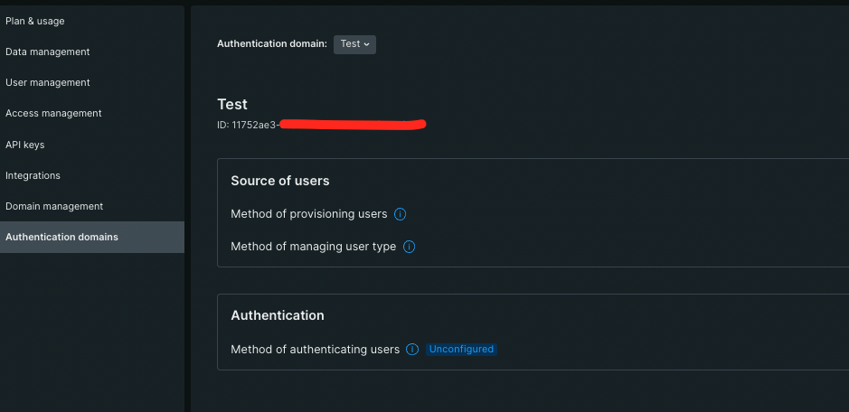
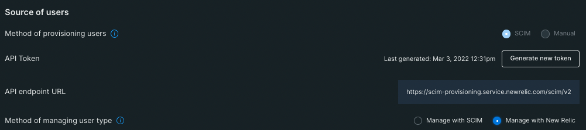

# usertype_by_group
Script to change user type based on the group a user is in.

Most of the time when users are added in groups from Identity Providers like Azure AD they need to be a certain New Relic user type. Unfortuantely some iDPs don't make it easy to automate this using SCIM even though our SCIM API is capable of creating a user type. See this [link](https://forum.newrelic.com/s/hubtopic/aAX8W0000008d6MWAQ/create-full-or-core-or-basic-user-types-in-azure-active-directory-using-scim) for an Azure example. 

To be able to change user types in New Relic you can utilize our NerdGraph API to make this change. This script utilizes this API and can be added as a synthetics script in New Relic and will periodically check all the users and what groups they are in then make the changes as desired. 

## Install
1. Create a user API key to be able to query NerdGraph. Please note the user creating this API key will need to have an Authentication Domain Manager role.
2. You will also need an ingest license key for the account you will install this script. This ingest license key will be used to create a custom event for audit purposes. Please note we store audit events in `NrAuditEvent` by default so this custom event can be used as a secondary backup for any user changes made by this script
3. Go to Synthetics Secrure credentials page and create secure credentials for the keys above as QUERY_USER_KEY -- for the User API key, AUDITEVENT_INGEST_KEY -- for the license key to store the audit events.
4. Add the account ID on line 8 to send the audit events.
5. Add the Authentication Domain ID for the Auth domain where your users and groups will be sourced. You can find this ID by going to the Administration page and clicking on the Authentication domains section, the ID will be displayed as shown below. 

6. Please note if you are using SCIM to provision users you will need to make sure the manage user types is changed to New Relic as shown on below screenshot. 

7. Create a Scripted API synthetic monitor with your preferences for name, frequency, and location.

